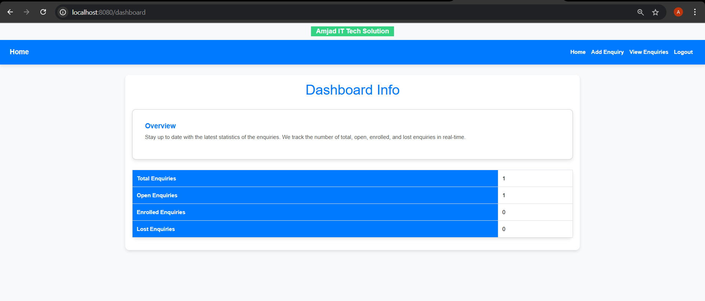
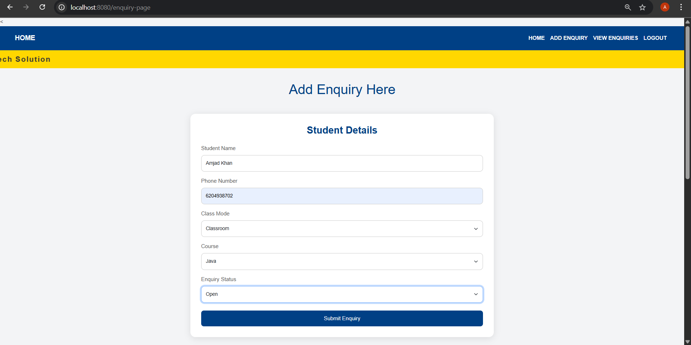
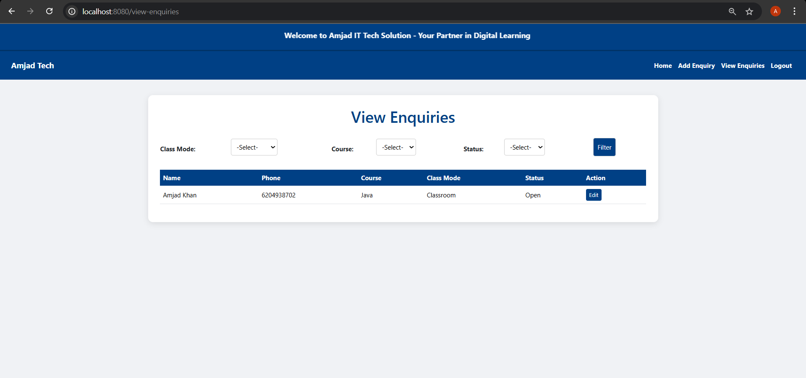

## Project Overview  
Counseller_Portal is a Spring Boot + Thymeleaf web application for managing student enquiries, enabling counsellors to **add**, **view**, **filter**, and **edit** enquiries with ease citeturn3search3turn3search1. It also provides a dashboard summary of total, open, enrolled, and lost enquiries for quick insights citeturn3search8. The UI is built with Bootstrap 5 for a responsive, modern look and feel citeturn3search0.

---

## Features  
- **Authentication**: Simple login/logout for counsellors.  
- **Add Enquiry**: Record student name, phone, course, class mode, and status.  
- **View & Filter**: Search enquiries by course, class mode, or status.  
- **Edit Enquiry**: Update existing enquiry details.  
- **Dashboard**: Visual cards summarizing total, open, enrolled, and lost enquiries at a glance.  
- **Responsive Design**: Mobile-first layout powered by Bootstrap.  
- **Thymeleaf Templates**: Server-side HTML rendering for fast, SEO-friendly pages. citeturn3search6

---

## Tech Stack  
| Layer     | Technology                                 |
|-----------|--------------------------------------------|
| Backend   | Java, Spring Boot                          |
| Frontend  | Thymeleaf, Bootstrap 5, HTML/CSS           |
| Database  | MySQL / H2 (configurable in `application.properties`) |
| Build     | Maven                                      |
| Server    | Embedded Tomcat                            |

---

## Getting Started

### Prerequisites  
- Java 17+ citeturn3news9  
- Maven 3.6+  
- MySQL (or H2 for in-memory testing)  

### Installation  
1. **Clone the repo**  
   ```bash
   git clone https://github.com/Amjad0786/Counseller_Portal.git  
   cd Counseller_Portal  
   ```  
2. **Configure database**  
   Edit `src/main/resources/application.properties` to set your MySQL credentials.  
3. **Build & Run**  
   ```bash
   mvn clean install  
   mvn spring-boot:run  
   ```  
4. **Access the app**  
   Open your browser at `http://localhost:8080` citeturn3search1.

---

## Usage  

1. **Login** with your counsellor account.  
2. **Navigate** to **Add Enquiry** to record a new student enquiry.  
3. **View Enquiries** to browse, filter, or edit existing records.  
4. **Dashboard** provides a quick statistical overview.

---

## Screenshots  

| Dashboard | Add Enquiry | View Enquiries |
|:----------:|:------------:|:--------------:|
|  |  |  |

---

## Contributing  
1. Fork the repo.  
2. Create a new branch: `git checkout -b feature/YourFeature`.  
3. Commit your changes & push to your fork.  
4. Open a Pull Request describing your changes.  


---

## License  
This project is licensed under the **MIT License**. See [LICENSE](LICENSE) for details citeturn3search3.

---

## Contact  
**Amjad Khan**  
- 📧 amjadkhan44734@gmail.com  
- 🔗 [LinkedIn](https://www.linkedin.com/in/amjadkhan44734)  

Happy coding! 🚀